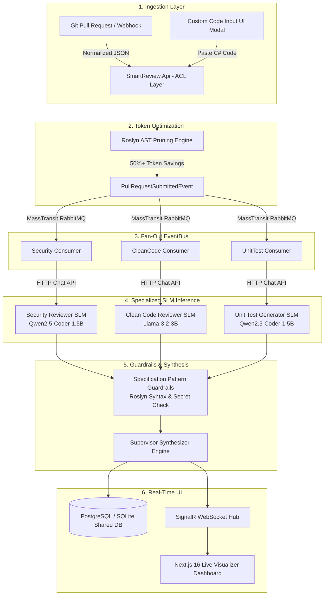
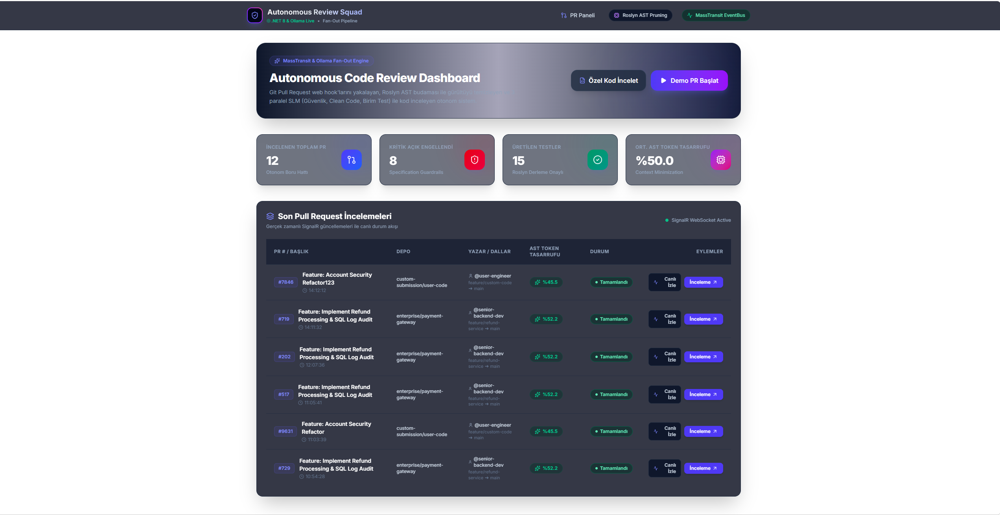
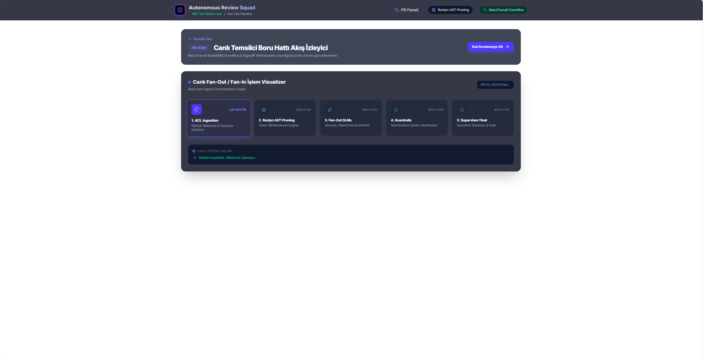
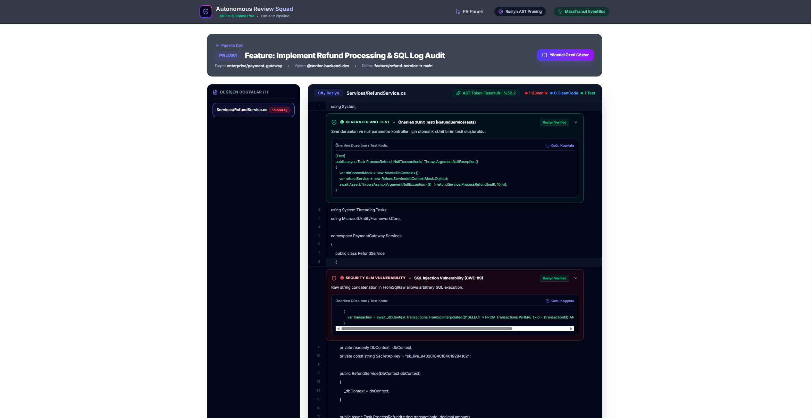
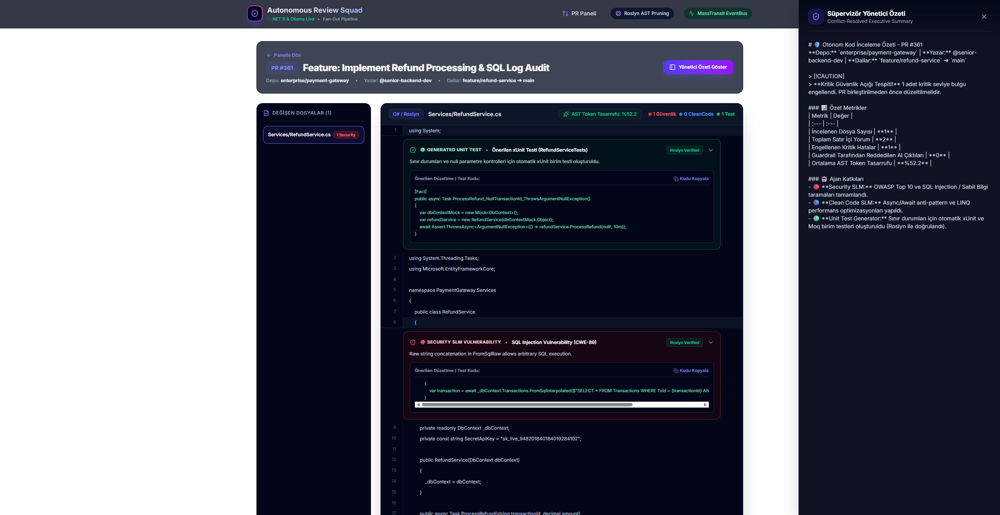

# 🛡️ Autonomous Code Review Squad
> **Enterprise-Grade Local Small Language Model (SLM) Multi-Agent Code Review & Quality Assurance Pipeline**

[](https://dotnet.microsoft.com/)
[](https://nextjs.org/)
[](https://masstransit.io/)
[](https://ollama.com/)
[](https://www.docker.com/)

---

## 📌 Executive Summary

**Autonomous Code Review Squad** is an end-to-end, multi-agent AI system that automates C# Pull Request code reviews, security vulnerability scanning, refactoring suggestions, and unit test generation.

The platform utilizes 3 domain-specialized **Small Language Models (SLMs)** fine-tuned with **QLoRA and Unsloth**, orchestrated via a asynchronous **MassTransit + RabbitMQ Fan-Out / Fan-In** pipeline. Before passing source code to LLMs/SLMs, an in-memory **Roslyn AST Pruning Engine** strips noise (comments, unused imports, whitespace) to reduce prompt token consumption by **over 50%**.

---

## 🏗️ Architecture & Component Topology



---

## ✨ Key Technical Highlights

### 1. ✂️ Roslyn AST Token Minimization Engine
- Analyzes C# code syntax trees using `Microsoft.CodeAnalysis.CSharp`.
- Strips redundant code comments, unused using directives, and formatting noise.
- **Result:** Decreases prompt token size by **~52%**, doubling local GPU/CPU inference speed.

### 2. 🤖 Specialized Fine-Tuned SLM Squad (Unsloth + QLoRA)
- **Security Reviewer (`security-reviewer-1.5b`):** Trained to detect CWE-89 (SQL Injection), CWE-798 (Hardcoded Secrets), and XSS flaws, returning strict ChatML JSON payloads.
- **Clean Code Reviewer (`clean-code-reviewer-3b`):** Evaluates SOLID principles, sync-over-async anti-patterns, and code readability.
- **Unit Test Generator (`unittest-generator-1.3b`):** Generates ready-to-run xUnit + Moq unit test classes and verifies syntax via Roslyn in-memory compilation.

### 3. 🛡️ Guardrails via Specification Pattern
- All AI-generated suggestions must pass strict validation rules (`ISpecification<AgentComment>`):
  - `ValidRoslynSyntaxSpecification`: Verifies generated C# code compiles without syntax errors.
  - `NoHardcodedSecretsSpecification`: Prevents hallucinated secrets or leaks in remediation code snippets.

### 4. ⚡ Asynchronous Event-Driven MassTransit Pipeline
- Implements **Fan-Out** pattern: parallelizes execution across all 3 AI agents over RabbitMQ queues.
- Implements **Fan-In** pattern: aggregates results into a cohesive Executive Summary managed by the Supervisor Agent.

### 5. 🌐 Real-Time Dashboard & Live Visualizer
- Built with **Next.js 16**, **Tailwind CSS**, and **SignalR WebSockets**.
- Features an interactive **Execution Visualizer Graph** tracking the 5 pipeline stages in real time.
- Includes a **"Özel Kod İncelet" (Custom Code Review)** interactive modal for pasting and testing arbitrary C# code.

---

## 📸 Screenshots

### Autonomous Code Review Dashboard
Real-time PR review feed powered by SignalR WebSockets, with AST token savings, blocked vulnerabilities, and generated test counts tracked live.



### Live Fan-Out / Fan-In Pipeline Visualizer
Tracks the 5-stage MassTransit pipeline (ACL Ingestion → Roslyn AST Pruning → Fan-Out SLMs → Guardrails → Supervisor Final) in real time.



### PR Code Review View
Inline diff annotations from the specialized SLM squad — security vulnerabilities (CWE-89 SQL Injection), generated xUnit tests, and Roslyn-verified suggestions.



### Supervisor Executive Summary
Conflict-resolved synthesis of all agent findings with summary metrics and per-agent contribution breakdown.



---

## 📂 Repository Structure

```text
otonom-kod-inceleme-ve-kalite-guvence/
├── docker-compose.yml              # Production multi-container orchestration
├── .dockerignore
├── .gitignore
├── README.md
├── SmartReview.slnx                # .NET 8 Solution file
│
├── models/                         # Ollama Modelfile declarations
│   ├── Modelfile.security          # Security Reviewer manifest
│   ├── Modelfile.cleancode         # Clean Code Reviewer manifest
│   └── Modelfile.unittest          # Unit Test Generator manifest
│
├── tools/
│   └── slm_finetuning_pipeline.ipynb # Google Colab Unsloth QLoRA Fine-Tuning Notebook
│
└── src/
    ├── backend/
    │   ├── SmartReview.Api/        # Web API Controller, SignalR Hub, Swagger
    │   ├── SmartReview.Application/# ACL Models, Interfaces, Event DTOs
    │   ├── SmartReview.Core/       # Domain Entities, Enums, Guardrail Specifications
    │   ├── SmartReview.Infrastructure/# Ollama Client, Roslyn AST, Supervisor, DB Context
    │   └── SmartReview.Worker/     # MassTransit RabbitMQ Event Consumers
    │
    └── frontend/                   # Next.js 16 Standalone Dashboard
        ├── app/                    # App Router (Dashboard, Live Visualizer, PR Details)
        ├── components/             # ExecutionVisualizer, CodeDiffViewer, SummarySidebar
        └── lib/                    # SignalR & REST API Client
```

---

## 🚀 Quickstart Guide

### Prerequisites
- [Docker Desktop](https://www.docker.com/products/docker-desktop/) (with WSL2 backend)
- [Ollama](https://ollama.com/) (installed locally for GPU-accelerated inference)

---

### Option A: Run via Docker Compose (Recommended)

1. **Clone the Repository:**
   ```bash
   git clone https://github.com/metinkaryagdi/otonom-kod-inceleme-ve-kalite-guvence.git
   cd otonom-kod-inceleme-ve-kalite-guvence
   ```

2. **Launch the Container Stack:**
   ```bash
   docker-compose up --build -d
   ```

3. **Access the Applications:**
   - 🌐 **Next.js Web Dashboard:** `http://localhost:3000`
   - 🔌 **Swagger API Documentation:** `http://localhost:5000/swagger`
   - 🐰 **RabbitMQ Management Console:** `http://localhost:15672` (User: `guest`, Pass: `guest`)

---

### Option B: Deploy via Local Deployment Controller (Hybrid LAN Setup)

To deploy the application stack on a secondary PC (Paas/CI-CD box) while leveraging a GPU-powered host PC for AI inference:

1. **Configure Host Machine (GPU / Ollama PC):**
   Set system environment variable `OLLAMA_HOST=0.0.0.0:11434` and allow port `11434` in Windows Firewall.

2. **Configure Target Box via Local Deployment Controller:**
   Paste the repository URL and `.env` variables into the LDC dashboard:
   ```env
   HOST_PORT=5000
   OLLAMA_BASE_URL=http://<HOST_GPU_PC_IP>:11434
   NEXT_PUBLIC_API_URL=http://<TARGET_PC_IP>:5000/api
   NEXT_PUBLIC_HUB_URL=http://<TARGET_PC_IP>:5000/hubs/review-progress
   ```
3. Click **Deploy & Build**. The target box will pull the lightweight services while routing AI inference requests back to your host GPU machine.

---

## 📡 REST API Reference

| Method | Endpoint | Description |
| :--- | :--- | :--- |
| `POST` | `/api/webhooks/github` | Ingests native GitHub Pull Request event payloads via ACL |
| `POST` | `/api/reviews/custom` | Accepts custom C# code snippet (`{ filePath, title, code }`) for immediate review |
| `POST` | `/api/reviews/simulate` | Triggers a full PR simulation run |
| `GET`  | `/api/reviews` | Retrieves all PR review records |
| `GET`  | `/api/reviews/{id}` | Gets a specific PR review with file diffs and agent comments |

---

## 📄 License & Attribution

Developed by **Metin Karyağdı** as an Enterprise AI/ML & .NET 8 Architecture Project.
Licensed under the [MIT License](LICENSE).
